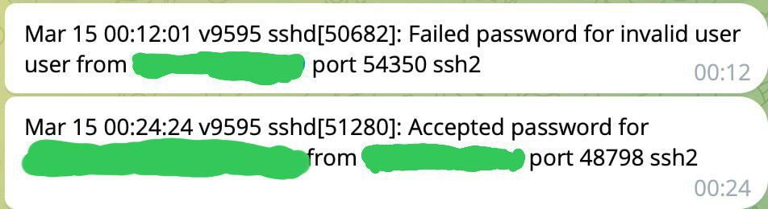

# TelegramBot

Every time there is a connection (whether successful or not) to your server via ssh, a notification will be sent via telegram bot

## How to use
> git clone https://github.com/ket03/TgBotLogSender.git

> cd TgBotLogSender/scripts

> nano bot.sh

Now, you must to get your chat id and bot token.

Chat id here: https://t.me/getmyid_bot

Token here: https://t.me/BotFather

Change values in bot.sh

> bot_token="TOKEN"
chat_id="ID"

Save

> sudo chmod +x bot.sh script.sh

> sudo nohup ./script.sh & sudo nohup ./bot.sh &

Completed. You can check:
> jobs

## Other
You can change:
>     if echo "$line" | grep -qE 'Accepted'
To
>     if echo "$line" | grep -qE 'Accepted|Failed'
And you will get Accepted and Failed attempts